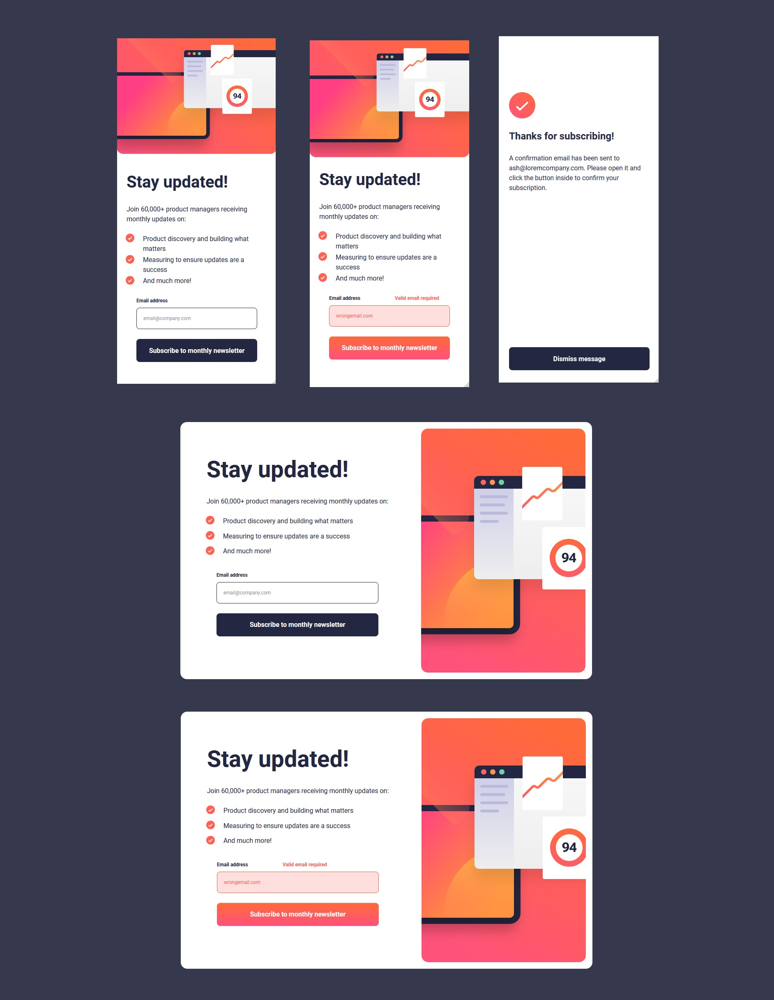

# Frontend Mentor - Newsletter sign-up form with success message solution

This is a solution to the [Newsletter sign-up form with success message challenge on Frontend Mentor](https://www.frontendmentor.io/challenges/newsletter-signup-form-with-success-message-3FC1AZbNrv).

## Table of contents

- [Overview](#overview)
  - [The challenge](#the-challenge)
  - [Screenshot](#screenshot)
  - [Links](#links)
- [My process](#my-process)
  - [Built with](#built-with)
  - [What I learned](#what-i-learned)
  - [Continued development](#continued-development)
  - [Useful resources](#useful-resources)
- [Author](#author)

## Overview

### The challenge

Users should be able to:

- Add their email and submit the form
- See a success message with their email after successfully submitting the form
- See form validation messages if:
  - The field is left empty
  - The email address is not formatted correctly
- View the optimal layout for the interface depending on their device's screen size
- See hover and focus states for all interactive elements on the page

### Screenshot

### Links

- Solution URL: [Github](https://github.com/i-prkr/newsletter-signup-form)
- Live Site URL: [Github Pages](https://i-prkr.github.io/newsletter-signup-form/)

## My process

### Built with

- Semantic HTML5 markup
- SCSS
- BEM
- Mobile-first workflow

### What I learned

I was able to learn about FormData, a much simpler way to collect data from forms with the ability to do so in one line:

`const userEmail = Object.fromEntries(new FormData(event.target)).userEmail;`

I was also helpful in this challenge to continue improving on how I am planning out solutions particularly with the BEM methodology in mind.

### Continued development

I am eager to continue improving how I am structuring my solutions to keep it as DRY as possible, particularly using BEM. I spent some time trying different ways to structure the `.card` sass and settled on keeping both the newsletter and success card styles under the one class.

### Useful resources

https://css-tricks.com/snippets/css/css-triangle/

- [BEM Methodology](https://en.bem.info/methodology/quick-start/#element) - This helped me as I continue to improve my BEM implementation.

## Author

- Frontend Mentor - [@i-prkr](https://www.frontendmentor.io/profile/i-prkr)
- Github - [Github](https://github.com/i-prkr)
